# 🚀 Portal Docente ISI 2025

**Centro Universitario UAEM Nezahualcóyotl – Ingeniería en Sistemas Inteligentes**

El **Portal Docente ISI 2025** es un entorno académico y técnico desarrollado para supervisar, desplegar y monitorear los proyectos de los equipos **PLN** e **ITM**.  
Integra **FastAPI (backend)** y **React (frontend)**, ambos contenedorizados y comunicándose internamente mediante **Docker Compose** y una red virtual compartida.

---

## 🧩 Arquitectura General

| Servicio | Rol | Imagen Base | Puerto Host | Puerto Interno | Descripción |
|-----------|-----|-------------|--------------|----------------|--------------|
| `proyecto_isi_backend` | Backend | `tiangolo/uvicorn-gunicorn-fastapi:python3.11` | `9090` | `80` | API principal del portal |
| `proyecto_isi_frontend` | Frontend | `nginx:1.25-alpine` | `9390` | `80` | Interfaz React + Nginx |
| `equipoX_backend` | Backend de equipo PLN o ITM | `tiangolo/uvicorn-gunicorn-fastapi:python3.11` | `900X` / `910X` | `80` | API de cada equipo |
| `equipoX_frontend` | Frontend de equipo PLN o ITM | `node:20` | `930X` / `940X` | `3000` | Aplicación web del equipo |

---

## 🧠 Diagrama de Arquitectura de Red (Docker)

```mermaid
graph TD
    A[🧑 Usuario - Navegador Web] -->|http://10.5.20.50:9390| B[🌐 Nginx + React (Frontend)]
    B -->|Proxy /api| C[⚙️ FastAPI (Backend Principal 9090)]
    C -->|Consulta /monitor/status| D[🧩 Contenedores PLN / ITM en red pln_net]
    D -->|Respuesta /health| C
    C -->|JSON con estado y latencia| B
    B -->|Renderización dinámica| A
```

> 🔹 Todos los contenedores están interconectados mediante la red **`pln_net`**, lo que permite comunicación directa por nombre (`equipo1_backend`, `itm3_frontend`, etc.) sin exponer puertos innecesarios.

---

## 🧰 Componentes del Proyecto

### 📁 Estructura de Carpetas

```
/srv/pln/proyecto_ISI/
│
├── app/
│   ├── backend/
│   │   ├── src/
│   │   │   ├── main.py
│   │   │   ├── api/routes/monitor.py
│   │   │   ├── api/routes/health.py
│   │   │   └── api/routes/metrics.py
│   │   └── requirements.txt
│   │
│   └── frontend/
│       ├── src/
│       │   ├── pages/Home.jsx
│       │   ├── pages/MonitorDashboard.jsx
│       │   ├── pages/EquiposDashboard.jsx
│       │   └── components/Layout.jsx
│       ├── nginx.conf
│       └── package.json
│
├── docker-compose.yml
└── Dockerfile
```

---

## 🌐 Red Interna `pln_net`

| Grupo | Contenedor Backend | Contenedor Frontend | Puerto Backend | Puerto Frontend | Repositorio |
|--------|--------------------|---------------------|----------------|-----------------|--------------|
| PLN 1 | equipo1_backend | equipo1_frontend | 9001 | 9301 | https://github.com/rromanc-coder/equipo1 |
| PLN 2 | equipo2_backend | equipo2_frontend | 9002 | 9302 | https://github.com/rromanc-coder/equipo2 |
| PLN 3 | equipo3_backend | equipo3_frontend | 9003 | 9303 | https://github.com/rromanc-coder/equipo3 |
| PLN 4 | equipo4_backend | equipo4_frontend | 9004 | 9304 | https://github.com/rromanc-coder/equipo4 |
| PLN 5 | equipo5_backend | equipo5_frontend | 9005 | 9305 | https://github.com/rromanc-coder/equipo5 |
| PLN 6 | equipo6_backend | equipo6_frontend | 9006 | 9306 | https://github.com/rromanc-coder/equipo6 |
| ITM 1 | itm1_backend | itm1_frontend | 9101 | 9401 | https://github.com/rromanc-coder/REPO_ITM1 |
| ITM 2 | itm2_backend | itm2_frontend | 9102 | 9402 | https://github.com/rromanc-coder/REPO_ITM2 |
| ITM 3 | itm3_backend | itm3_frontend | 9103 | 9403 | https://github.com/rromanc-coder/REPO_ITM3 |
| ITM 4 | itm4_backend | itm4_frontend | 9104 | 9404 | https://github.com/rromanc-coder/REPO_ITM4 |
| ITM 5 | itm5_backend | itm5_frontend | 9105 | 9405 | https://github.com/rromanc-coder/REPO_ITM5 |
| ITM 6 | itm6_backend | itm6_frontend | 9106 | 9406 | https://github.com/rromanc-coder/REPO_ITM6 |
| ITM 7 | itm7_backend | itm7_frontend | 9107 | 9407 | https://github.com/rromanc-coder/REPO_ITM7 |
| ITM 8 | itm8_backend | itm8_frontend | 9108 | 9408 | https://github.com/rromanc-coder/REPO_ITM8 |

---

## ⚙️ Despliegue Automático (CI/CD)

```mermaid
graph LR
    A[👩‍💻 Alumno / Profesor] -->|git push| B[📦 GitHub Repository]
    B -->|Trigger main branch| C[⚙️ GitHub Action - deploy.yml]
    C -->|Rsync código a servidor| D[🖥️ Runner Self-Hosted - UAEM Neza]
    D -->|docker compose build --no-cache| E[🐳 Docker]
    E -->|Crea imágenes backend/frontend| F[🚀 Portal en ejecución]
    F -->|Acceso público| G[🌍 http://10.5.20.50:9390]
```



---

## 📊 Monitoreo y API Interna

| Endpoint | Método | Descripción |
|-----------|--------|--------------|
| `/health` | GET | Confirma el estado general del backend |
| `/monitor/status` | GET | Devuelve JSON con el estado de todos los servicios PLN/ITM |
| `/metrics` | GET | Mide tiempos de respuesta y disponibilidad |

Ejemplo de respuesta:

```json
{
  "services": [
    {
      "name": "PLN Backend 9001",
      "status": "UP",
      "latency_ms": 125.7,
      "url": "http://10.5.20.50:9001/health",
      "repo": "https://github.com/rromanc-coder/equipo1"
    },
    {
      "name": "ITM Frontend 9408",
      "status": "DOWN",
      "latency_ms": null,
      "url": "http://10.5.20.50:9408/health",
      "repo": "https://github.com/rromanc-coder/REPO_ITM8"
    }
  ]
}
```

---

## 🧩 Componentes del Frontend

| Componente | Archivo | Descripción |
|-------------|----------|-------------|
| 🏠 **Home** | `src/pages/Home.jsx` | Portal principal con accesos a todos los módulos |
| 📊 **MonitorDashboard** | `src/pages/MonitorDashboard.jsx` | Vista general de estado por servicio |
| 🧠 **ServiceDashboard (NOC Técnico)** | `src/pages/EquiposDashboard.jsx` | Dashboard técnico en tiempo real con latencias |
| 🧭 **Layout** | `src/components/Layout.jsx` | Barra superior, navegación y footer global |

---

## 🧠 Conceptos Didácticos Aplicados

- Contenerización con **Docker y Docker Compose**
- Creación de APIs RESTful con **FastAPI**
- Desarrollo de frontends modernos con **React + TailwindCSS + Framer Motion**
- Integración continua y despliegue automatizado (**GitHub Actions CI/CD**)
- Monitoreo de servicios y métricas en tiempo real
- Redes virtuales en entornos de laboratorio (**`pln_net`**)
- Buenas prácticas de arquitectura distribuida y documentación técnica

---

## 👩‍🏫 Créditos

Proyecto académico desarrollado bajo la guía de  
**M. en C. Ricardo Román Cuevas**  
Centro Universitario UAEM Nezahualcóyotl  
**Ingeniería en Sistemas Inteligentes – 2025 ©**

---
